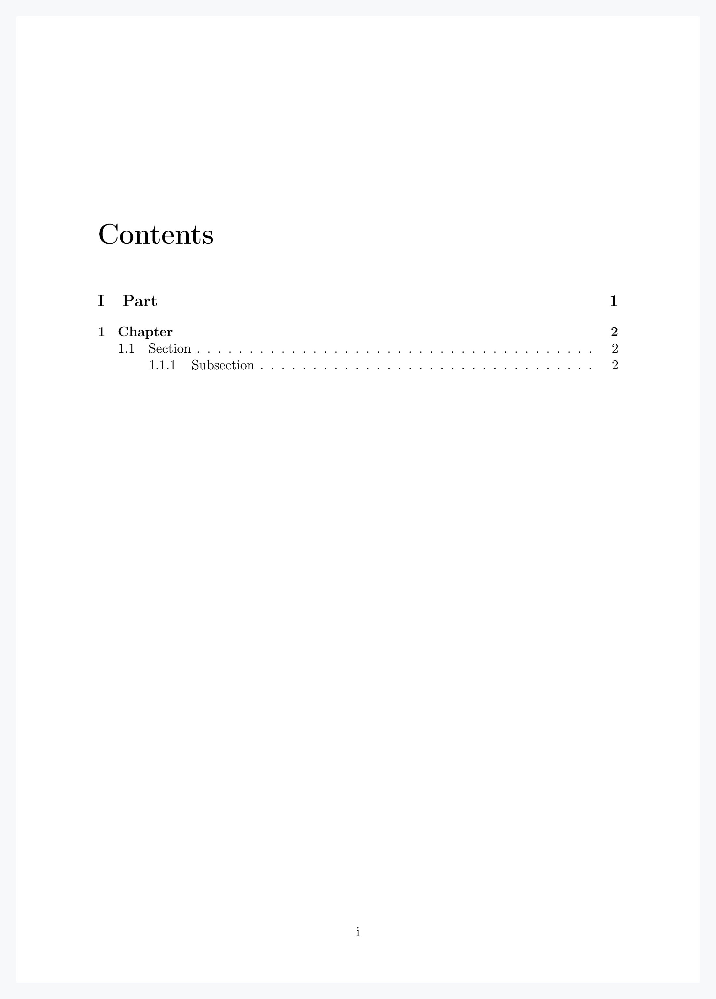
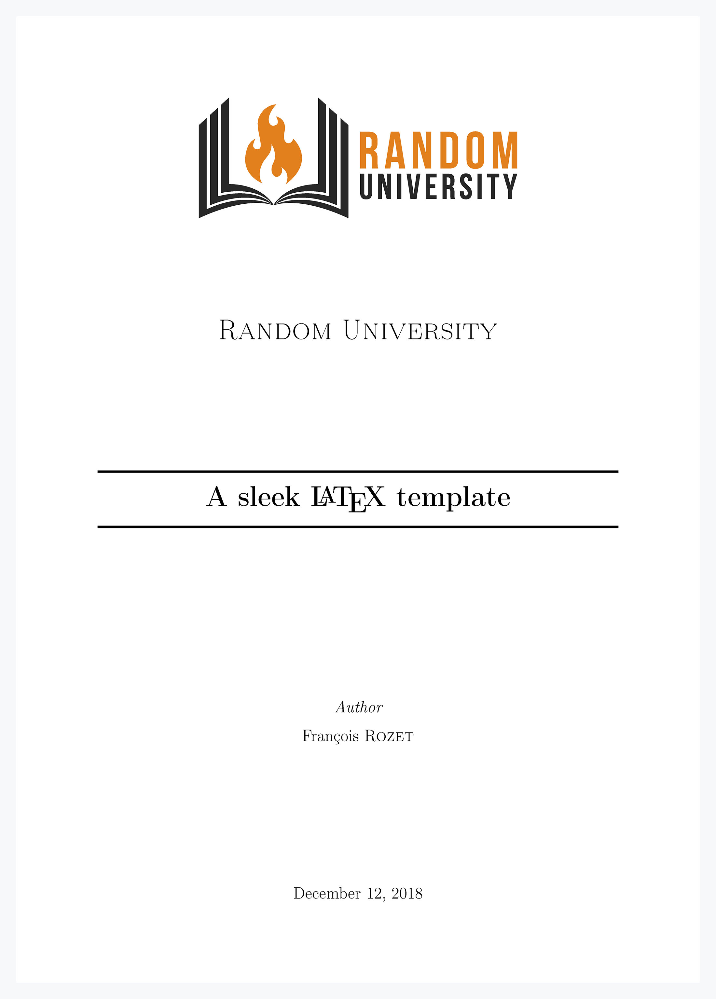

# Sleek Template

Sleek Template is a modular LaTeX template.

It splits in three parts : `main.tex`, `head.tex` and `titlepage.tex`.

## main

`main.tex` is the actual `tex` file of the document where is written the `document` environment.

```latex
\begin{document}
...
\end{document}
```

It is `main.tex` that should be compiled in order to produce a `pdf` or a `dvi`.

## head

`head.tex` is included in `main.tex` before the `document` environment.

```latex
\input{./include/head.tex}
...
\begin{document}
```

This file

* calls common packages so that the main file is not overloaded.
* setups style parameters of the document such as headers/footers, margins, indentations, etc.
* defines new commands such as `\st`, `\fact`, `\mytableofcontents`, etc.

Feel free to add packages or to modify any feature.

### Commands

```latex
\st, \tq, \cad, \Cad
```

<p align="center">
    
</p>

```latex
$\fact{n}$, $\e{n}$, $\deriv x$, $\tr{A}$
```

<p align="center">
    
</p>

```latex
\begin{env}
    Lorem ipsum dolor sit amet.
\end{env}
```

<p align="center">
    
</p>

Replacing `env` respectively with `thm`, `proof`, `lem`, `prop`, `defn`, `hyp`, `quest`, `answ`, `expl`, `rmk`, `note` and `tip`.

```latex
\mytableofcontents
\part{Part}
\chapter{Chapter}
\section{Section}
\subsection{Subsection}
\subsubsection{Subsubsection}
```

<p align="center">
    
</p>

Displays the table of contents in a new page while temporarily changing the page numbering to `roman`.

### Languages

To set the languages of the document, the `\languages` variable has to be defined **before** the call to `head.tex`.

```latex
\def\languages{vietnamese, japanese, danish}
...
\input{./include/head.tex}
```

If not, languages will be set to `english` by default. It should be noted that the actual language of the document is defined by the last one of the chain, `danish` in the example.

If the document language is set to `french`, `theorem` environment names will be displayed in French. It is possible to add `theorem` environment names for another language `lng` by writing the following into the *Theorems and Definitions* section of the `head.tex` file.

```latex
\IfStrEq{\languagename}{lng}{
    \def\lgthm{Theorem}
    \def\lglem{Lemma}
    \def\lgprop{Proposition}
    \def\lgdefn{Definition}
    \def\lghyp{Hypothesis}
    \def\lgquest{Question}
    \def\lgansw{Answer}
    \def\lgexpl{Example}
    \def\lgrmk{Remark}
    \def\lgnote{Note}
    \def\lgtip{Tip}
}

\IfStrEq{\languagename}{french}{
    \def\lgthm{Théorème}
    ...
```

## titlepage

`titlepage.tex` is included as first command in the `document` environment.

```latex
\begin{document}
\input{./include/titlepage.tex}
...
\end{document}
```

It creates the cover page of the document according to the filling of the followings above the `document` environment.

```latex
\def\logopath{}
\def\toptitle{}
\title{}
\def\subtitle{}
\def\authorhead{}
\author{}
\def\rightauthorhead{}
\def\rightauthor{}
\def\context{}
\date{}
```

Among these, only `\title{}`, `\author{}` and `\date{}` have to be filled in for the code to figure out what to output. However, none of these should stay empty. Prefer deleting or commenting the line if so.

```latex
\def\logopath{./include/resources/pdf/logo.pdf}
\def\toptitle{Random University}
\title{A sleek \LaTeX{} template}
%\def\subtitle{}
\def\authorhead{Author}
\author{François \textsc{Rozet}\\}
%\def\rightauthorhead{}
%\def\rightauthor{}
%\def\context{}
\date{\today}
```

<p align="center">
    
</p>

## Authors

* **François Rozet** - [Donshel](https://github.com/Donshel)
